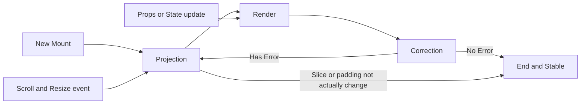

# Table of Content
  
  
  
  
  
  
  
  
  
* [Table of Content](#table-of-content )
* [How this works?](#how-this-works )
* [Important field](#important-field )
  
  
  
  
  
  
  
# How this works?
  
  

  
The responsibilities of each step are below:
  
1. Projection:
   1. Create the `movie` object used by the whole system, according to the passed `this.props.data`.
   1. Calcuate the rendering slice index and fake padding using in-cache algorithm.
   1. Call for next render.
1. Render:
   1. Render with given state and data.
   1. Update the in-line hight cache.
1. Correction:
   1. Calcuate the errors.
   1. Reschedule projection when necessary.
  
# Important field
  
  
1. The rendered hight map could be used by any component that wants to get inline caches.
1. The movie object could be stored or serialized to json format, for caching and position restore. :smile: Very neat feature will be based on this one.
  